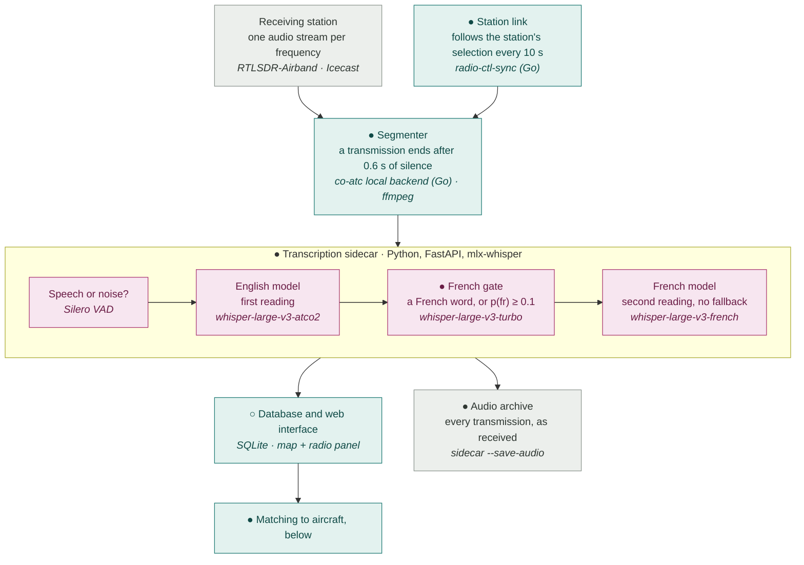
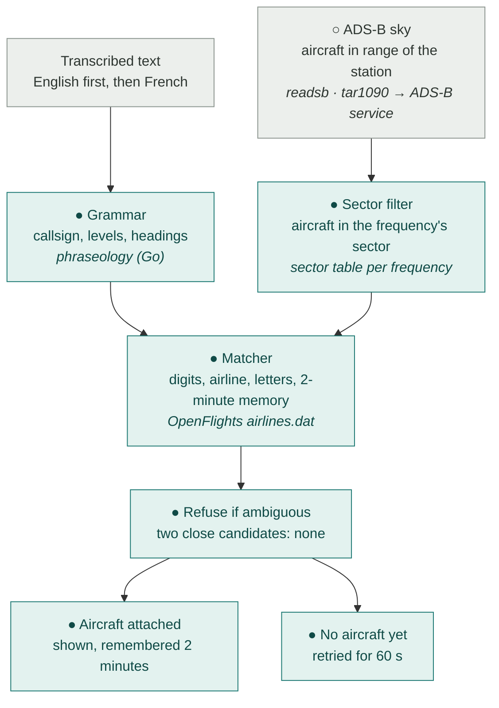

# atc-scribe

*A fork of [Co-ATC](https://github.com/yegors/co-atc) that does the listening on
your own machine.*

**Listen to the air traffic control radio above your house, and have a computer
write down what was said — without sending a single second of audio to anyone.**

A small antenna on a rooftop can pick up two things at once: the position reports
that airliners broadcast continuously, and the voices of the pilots and controllers
talking to each other. The first is easy for a computer to read. The second is just
sound.

This project joins the two. It shows the aircraft on a map, listens to the radio,
turns the speech into text, and works out **which aircraft each transmission was
about** — so that clicking a dot on the map shows you what that particular aeroplane
just said, and what it was told to do.

It is a fork of [Co-ATC](https://github.com/yegors/co-atc), which already did all of
this beautifully — but by sending the audio to OpenAI. **This fork does the same work
on the machine in the room**, on a receiving station in France where the radio is
half French and half English.

> Everything here runs on one Mac mini. No API key, no subscription, no audio leaving
> the house. The only thing the project needs from the internet is the weather.


---

## Why a fork

Upstream Co-ATC calls the OpenAI API in three places: to transcribe the radio, to
tidy up the transcript and extract clearances, and to run a voice assistant. For a
station that runs continuously, that means a recurring bill, a dependency on the
network, and every transmission the receiver hears being uploaded to a third party.

It is also, for this station, the wrong tool: the radio here is **bilingual**. French
and English alternate on the same frequency, sometimes in the same exchange, and the
models that are good at air-traffic English are good at it precisely because they
were fine-tuned on English-only corpora.

So this fork replaces the cloud pieces with local ones, and — because the local
pieces are worse in some ways and better in others — **measures the difference
instead of assuming it**. Every number below was recorded on a real receiver, and the
working notes that produced them are in [`docs-fr/`](docs-fr/) (in French).

## What is different from upstream

| | upstream | atc-scribe |
|---|---|---|
| Speech to text | OpenAI `gpt-4o-transcribe` | local Whisper via [MLX](https://github.com/ml-explore/mlx) in a Python sidecar |
| Transcript post-processing | GPT-4o with a 90-line prompt | a closed-vocabulary **phraseology grammar**, no model |
| Callsign → aircraft matching | GPT-4o, given the live ADS-B list | weighted edit distance against the same list |
| Authentication | none | Argon2id + server-side sessions |
| Operational state | not exposed | `GET /api/v1/server` — database growth, disk, retention |
| Voice assistant | OpenAI Realtime | untouched, and off unless you supply a key |
| Weather | Windy | unchanged so far — see `Q7` in the working notes |

Upstream's map, ADS-B ingestion, flight-phase detection and web interface are used
**as they are**. They are the larger and better half of this program, and nothing
here improves on them.

## Status, honestly

**Running on one station since September 2026**, started when its owner listens, and
incomplete. Figures as of 28 September 2026.

What works, with the number that says so:

- **Local transcription end to end.** English model
  `sfabriece/whisper-large-v3-atco2-asr-mlx`, chosen not by listening to it but by
  ADS-B arbitration: on 1 468 real transmissions it produced **94 true callsign
  matches against 62.6** for the English-only alternative, and won on all five
  frequencies.
- **One audio stream per frequency.** The station publishes each channel it listens
  to on its own stream, and co-atc follows whatever is on air. Transcribed separately,
  the same traffic gives **four times the true matches** of the mixed stream (235
  against 60).
- **Callsign matching.** On the reference capture (four Roissy frequencies, 24/09),
  the matching rules went from 240 true matches at 73 % precision to **387 at 85 %**.
  Live, on two De Gaulle approach frequencies for two hours (28/09): **213.6 true
  matches out of 671 transmissions, 92 % precision**. The control is not a guess:
  the same rules are run against the ADS-B sky of other moments, and what they match
  there is subtracted as chance.
- **A French second reading.** When a transmission holds a French word, or when a
  multilingual Whisper gives French a probability of at least 0.1, the French model
  reads it too, once, without temperature fallback. **+7 to +8 % true matches at
  equal precision**, on three benches and live. Median delay from the end of a
  transmission to its text: 6.5 s on two frequencies, with no backlog building up.
- **A voice activity gate that is a correctness requirement, not an optimisation.**
  On four of this station's seven night-time channels, **up to 98 % of squelch
  openings carry no speech at all** — and a Whisper model fed silence does not return
  silence, it returns plausible sentences. Silero VAD in front of the model.
- **An audio archive.** Every transmission is kept as received, with a daily manifest
  that joins it to its database row: the raw material for improving recognition.
- **Authentication**, because the fork made the server worth reaching from outside
  the LAN. 29 tests in `internal/auth`.
- **A database that stays bounded.** Upstream opens the daily SQLite file once and
  never reopens it (measured here at 1.49 GB in 4 h 15). It now rotates at midnight;
  the per-second ADS-B rows no longer carry a JSON copy of themselves (**−73 %**,
  9.8 → 2.6 GB a day); and the daily files are kept within a size, 20 GB by default,
  instead of a number of days.

What does not work yet, and is known:

- **The transcript itself.** Matching works around it, but beyond callsigns and
  numbers the text is mostly unusable. Most errors are invented words (59 % of the
  English model's errors, 93 % of the French model's, on hand-annotated clips), and
  the English model's gibberish is made of real air-traffic words in the wrong order:
  only 6 % of its words fall outside the ATC vocabulary, yet 55 to 63 % of its
  transcripts hold at least one. Three fine-tuning trials so far, none better than
  production. Improving recognition itself, without transcribing thousands of hours
  by hand, is now a workstream of its own.
- **Reception.** On the weaker frequencies the squelch closes for a moment in the
  middle of transmissions: 33 to 47 % of transmissions chopped on the De Gaulle
  approaches. It comes from the reception at the station, not from the speaker's
  distance nor from the software.
- **Coupled sectors.** In the evening the controllers merge approach sectors, and the
  same transmission then arrives on two frequencies: 65 to 76 % of them over most of
  one evening measured. It is transcribed and counted twice.
- **En-route sectors** get no sector filter: their limits are not published.
- **Weather** still comes from Windy's private API, which has nothing for the nearest
  airfield; a French source is still to be chosen.

## How it works

Two diagrams: from the radio to the text, then from the text to the aircraft.
**●** marks a component written for atc-scribe, **○** an upstream Co-ATC component
it adapts; unmarked boxes are third-party software, models, or the receiving station.





What each piece bought, as true callsign matches (attached to the right aircraft, minus
what shuffled ADS-B skies give by chance), measured on this station:

| Piece | Effect | Measured on |
|---|---|---|
| One stream per frequency instead of the mix | ×4 | 235 against 60, 24/09 capture |
| The week's matching rules | 240 → 387 | the 24/09 reference capture |
| Language detector at the French gate | +7 to +8 % at equal precision | three benches and a live session, 28/09 |
| French read without temperature fallback | half the French decoding time, same matches | two benches, 28/09 |

### The sidecar

A ~350-line FastAPI service (`sidecar/`) that upstream itself specified but never
built — the contract is written down in **upstream's own**
[`docs/LOCAL-STT.md`](docs/LOCAL-STT.md), and this implements it. It holds the MLX
Whisper models in memory, runs Silero VAD in front of them, and refuses anything that
is not speech.

Two settings there are counter-intuitive and both were measured:

- **The upstream transcription prompt is removed, not translated.** It multiplies
  degeneration loops sevenfold on French audio, doubles decoding time, and leaks into
  the output (`"Aircraft are at cruise level and use ICA-7, Yankee Papa…"`). It was
  written for a continuous realtime stream; on a 3-second transmission it outweighs
  the audio.
- **The language is chosen per frequency, not detected.** Detection fails mostly on
  files that are already lost, so the per-frequency prior is both cheaper and safer.

### The phraseology grammar

Upstream's second stage asks GPT-4o for five things. Four of them are not language
problems at all:

| | what the prompt asks for | grammar? |
|---|---|---|
| 1 | freely correct transcription errors | **no** — the only real need for a language model |
| 2 | write numbers, headings, levels and frequencies as digits | yes |
| 3 | decide whether the speaker is ATC or a pilot | yes, from verb mood and callsign position |
| 4 | attach the transmission to a callsign **from the live ADS-B list** | yes — weighted edit distance over a short, known list |
| 5 | extract clearances and the runway | yes, closed patterns |

Point 4 is the trick that makes the whole product work, and it is not magic: the
model is handed the aircraft the receiver can currently see and forbidden to invent
others. Matching `"nonsense three five three"` against 128 known callsigns is
arithmetic.

Point 1 is the one we do without — and we measured what that costs before giving up
on it. A dictionary-based text corrector gained **one transmission and lost four
candidates**. It was deleted.

The grammar plugs in at **upstream's own seam** (`post_processing.backend = "local"`)
and writes into upstream's tables with upstream's vocabulary. Zero schema migration,
and you can switch back to GPT-4o with one config key to compare them on the same
traffic.

Its settings come from a sweep, not from taste — 3 digits minimum, 60-second fleet
window, ambiguous matches refused, no additional score floor. The full table is in
`docs-fr/19-appariement-en-ligne.md` and repeated as a comment in
`configs/config.toml.example`, so that the trade-off stays the operator's.

One rule that looks obviously good and is not: accepting callsigns whose digits are
**off by one** was measured to be **81 % noise**. It is off by default.

### Authentication

Upstream says, correctly, that it must never be exposed to the internet. This fork
adds enough to make that a choice rather than a fact.

- **The first visit asks the question**: this machine only, without sign-in, or
  reachable with an account. The answer is kept beside the configuration
  (`configs/users.json`, never `config.toml`) and can be changed later under
  *Settings → Server → Access*, either way. Going local-only keeps the accounts,
  unused, for when sign-in is required again.
- **Without sign-in only where nobody else can reach it**: bound to `127.0.0.1`,
  with no proxy declared. Otherwise the first visit offers only an account, the
  settings refuse to turn sign-in off, and a server listening beyond `127.0.0.1`
  with no account refuses to start.
- **Argon2id** (m = 64 MiB, t = 3, p = 2), PHC-encoded. Passwords are never written
  to a file by a human: `co-atc -add-user <name>` reads one without echoing it and
  prints the block to paste into the config.
- **Server-side sessions**, 256 bits of randomness, sliding expiry, revocable. No
  JWT — a token you cannot revoke is not an improvement.
- **Cookies** are `HttpOnly` and `SameSite=Strict`, and `Secure` as soon as the
  request is HTTPS.
- **`X-Forwarded-Proto` and `X-Forwarded-For` are trusted from nothing by default.**
  You list the proxy CIDRs explicitly. A reverse proxy is supported, not required:
  the server will terminate TLS itself if you give it a certificate, and will run
  plain HTTP on a LAN if you do not.
- An unknown username is verified against a **decoy hash**, so it costs the same as a
  known one and cannot be told apart.

## Requirements

- **Go 1.23** or later
- **FFmpeg** — audio ingestion (upstream's installation notes still apply, see
  [`README-upstream.md`](README-upstream.md))
- **An ADS-B source** — a local `tar1090`/`readsb` is what this is built against
- **An audio source** — an Icecast mount, or any stream FFmpeg can read
- **Python 3.11+ and Apple Silicon** for the transcription sidecar. MLX is
  Apple-only; on other hardware, point `[transcription.local] server_url` at any service
  that honours the `docs/LOCAL-STT.md` contract.
- **No OpenAI key**, unless you want the voice assistant, which is untouched.

## Getting started

```bash
git clone https://github.com/<you>/atc-scribe.git
cd atc-scribe
cp configs/config.toml.example configs/config.toml
go build -o bin/co-atc ./cmd/server
```

> The binary is still called `co-atc`, and the Go module path is still upstream's.
> Both are deliberate: on macOS the Local Network permission is granted **per
> executable**, so renaming the binary means re-granting it — and a permission that
> was silently not granted looks exactly like a network outage. Changing the module
> path would touch every import in every Go file, and with it every future diff
> against upstream.

Install the transcription sidecar's dependencies:

```bash
pip install -r sidecar/requirements.txt
```

You do not run it yourself. Set `[transcription.local] command` in the config and
**co-atc starts the sidecar with it and stops it on exit** — a transcription
service has no reason to outlive its only client. Measured: a cold sidecar
answers in 1.6 s, and its first transcription costs 2.2 s more than the next, so
there is nothing to gain by leaving one running.

If you would rather run it yourself — in another terminal, on another machine,
in a container — leave `command` empty and point `server_url` at it. Upstream's
contract is a URL for exactly that reason.

Either way co-atc probes `/health` before it serves anything and **refuses to
start if nothing answers**. Without that it would start perfectly and transcribe
nothing, one error line per transmission.

```bash
./bin/co-atc -config configs/config.toml
```

Then open `http://localhost:8000`. The first visit asks whether the server is for
this machine only or needs an account.

To write an account into the configuration instead, `./bin/co-atc -add-user alice`
reads a password without echoing it and prints a `[[auth.users]]` block to paste into
`configs/config.toml`; it writes nothing itself.

> **The shipped example still defaults to `backend = "openai"`** for both
> transcription and post-processing, so that a checkout behaves like upstream. To get
> what this fork is for, set `backend = "local"` in both
> `[transcription]` and `[transcription.post_processing]`.

## Also in here

- **`cmd/phraseology`** — the measurement tool. It replays a capture or a database
  through the exact production rules and reports matches against shuffled controls.
  Most of the numbers in this README came out of it.
- **`assets/spoken-operators.csv`** — radio operator names **as this station hears
  them**, including the mangled ones (`mazda` → Malta Air), with the evidence count
  behind each line. Not an aeronautical reference; a record of observations.
- **`tools/annotate`** — a small annotation UI for building ground truth.

## The working notes

`docs-fr/` is the project's memory, in French, and it is the honest part: it records
what was measured, what was eliminated, and **what was concluded wrongly and
withdrawn**. `docs-fr/05-decisions.md` in particular carries decisions on one side
and open questions on the other, and is kept current as a rule rather than a habit.

`docs/` belongs to upstream and is left as it is.

## Credits and licence

This is a fork of **[yegors/co-atc](https://github.com/yegors/co-atc)** by Yegor S,
MIT licensed, and it stays MIT. Upstream's `LICENSE` and copyright notice are
preserved unchanged; upstream's git history is preserved and reachable through the
`upstream` remote.

The map, the ADS-B pipeline, the flight-phase detection and the entire web interface
are upstream's work.

Several pieces here are meant to be useful back to upstream and are kept separable
for that: the transcription sidecar (which implements upstream's own documented
contract), the database rotation fix, the authentication package, and the operational
state endpoint.
